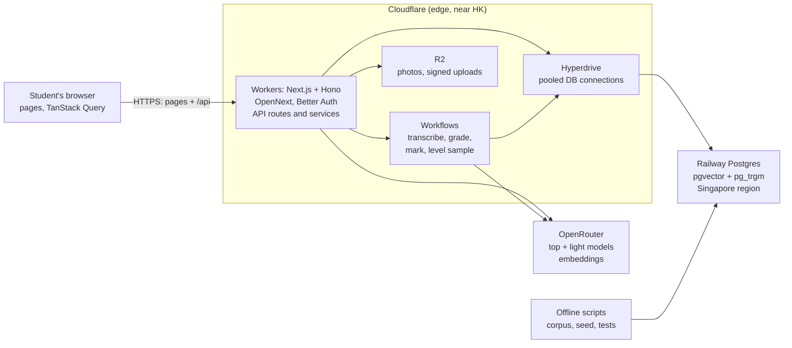

# HKDSE Practice App — Plan & Design

As of 2026-10-07. Summary of [SPEC.md](../SPEC.md) and [docs/design/](design/). Shared doc: [HKDSE Practice App — Plan & Design](https://claude.ai/code/artifact/d625b11e-eac9-4ba0-a359-bccbc98de908).

## Overview

A free, deployed practice app for HKDSE students (S4–S6, mainly in Hong Kong). It generates DSE-style questions, gives AI feedback and marking on students' own work, and tracks each student's weaknesses. There are no teacher accounts: each student has their own history.

| Release | Subjects | What it adds |
| --- | --- | --- |
| v1: local | Chinese writing, English writing, Maths Compulsory Part | Frontend + AI with no database or sign-in: work is saved in the browser (IndexedDB) with backup export/import; the server is a stateless AI API with a rate limit. The full writing loop and Maths CP practice and marking |
| v1.5: cloud | Same | Accounts, Postgres, credits, shared question bank, shared answers with voting, exemplar-anchored DSE estimates (already built, switched off) |
| v2 | M1, M2 | Curves and graphs, numeric checks of symbolic answers |
| v3 | Physics | Circuit, ray, free-body and wave diagrams; Physics archetypes and marking |

## Writing (Chinese, English) — v1

A student goes from a question to feedback and an upgraded model of their own essay in six steps.

1. **Pick a question.** Generate any DSE task (Chinese 乙部 and 甲部, English Part A and Part B), search the shared bank, or enter their own teacher's prompt.
2. **解題 (task analysis).** What the task asks, text type, audience, purpose, tone and register, traps, and what to prepare.
3. **Ask-AI helpers.** 寫作大綱 (outline), vocabulary with synonyms, sentence patterns, idioms or 成語. **Scaffolding only:** never full paragraphs before the student submits.
4. **Type or upload.** Photos are transcribed exactly: errors kept, unsure characters flagged, words inserted between lines highlighted. The student can edit anything; every change from the AI's reading is tracked.
5. **Feedback.**
   - A 解題 recap: did the essay meet the task?
   - Strengths, then errors: 錯別字, 病句, 佳句 and 繁簡混用 (Chinese); tagged errors (English).
   - Vocabulary and sentence-structure upgrades, each tied to the student's own sentence.
   - Optional **DSE estimate (beta)**: marks per criterion and a level. Chinese 甲部 gets feedback only.
6. **Level sample.** An upgraded rewrite of the student's own essay, side by side with a note on each change. The target defaults to one level above their estimate and can be changed.

## Maths CP, M1, M2 and Physics

Every question comes with its answer, an HKEAA-style marking scheme, 解題 thinking and tips, and a student's uploaded working is marked mark by mark.

- **Generate** by topic (Learning Unit or `PHY-*` topic), by question type (MC, short, long, experiment; difficulty; extension), or from a photo of a reference question. The shared bank is checked first, so repeat requests are free.
- **Rendering:** LaTeX in every stem, solution and scheme, drawn with KaTeX. Figures are JSON specs drawn by our own components (geometry; circuits, ray, free-body and wave diagrams for Physics) plus Mafs for function graphs.
- **Verification:** code checks every numeric answer (mathjs, units, accepted ranges); M1/M2 symbolic answers are checked at random points. Proofs and explanations are flagged "not code-verified". Only checked questions enter the bank.
- **Marking:**
  - MC is marked instantly with no AI, and shows the misconception behind the chosen option.
  - Written work is transcribed to LaTeX, checked by the student, then marked with M and A marks: method marks follow an earlier error, answer marks need the unit, "show that" earns method marks only.
  - Every mark comes with a reason, and the first wrong step is highlighted.
  - Labelled **"AI-marked, beta"**, with a dispute button; disputes become test data.

## Question bank and shared answers

Students can search every checked question in the shared bank for free, and can choose to publish their own answers for others to vote on.

**Question bank search**

- Filters: subject; topic (writing genre, text type and paper part; Maths CP, M1 and M2 Learning Units; `PHY-*` topics); question type; difficulty; extension; language; "not yet attempted".
- Keyword search works in Chinese and English: semantic search over embeddings, plus exact-phrase matching.
- Results show a rendered preview, topic chips, rating and an "attempted" badge. Private questions (from a reference photo or a student's own prompt) and reported questions never appear.

**Shared answers**

- Every writing submission and practice attempt is **private by default**. The owner can make it public, and hide it again at any time.
- A public answer shows the final text only (never photos), under a nickname. Score and feedback are included only if the author chooses.
- Community answers on a question unlock **after the viewer has submitted their own**, so they can't copy first.
- Upvote or downvote: one vote per student, changeable, not on your own answer. Three reports hide an answer for review. Publishing is blocked if the text contains a phone number, email or school name.

## Credits, privacy and copyright

The app is free with 100 credits a day per student, reset at 00:00 HKT; credits are charged before a job and refunded if it fails.

| Action | Credits |
| --- | --- |
| Question from the bank, MC marking, search, voting | 0 |
| 解題 | 1 |
| New question, one writing helper, reference-photo understanding | 2 |
| Transcribe one photo page | 3 |
| Mark written work (per question) | 5 |
| Writing feedback | 8 |
| DSE estimate (on top of feedback) | 5 |
| Level sample | 10 |

Light tasks use a cheaper model; transcription, grading, marking and samples use the top model. Every AI call is logged with its cost.

**Privacy.** Users are minors in Hong Kong, so the Personal Data (Privacy) Ordinance applies. The app collects only email, display name, form, subjects, exam language and an optional nickname. Student work is visible only to its owner unless they publish it. Students can delete their account and everything with it. Photos are deleted after 180 days.

**Copyright.** HKEAA past papers and exemplar scripts are used internally only, to calibrate scores and shape generated questions. Students only see AI-generated questions and AI-written model passages.

## Stack and deployment

One Next.js app runs on Cloudflare Workers near Hong Kong, and one Postgres database runs on Railway in Singapore.



Workers and Workflows both call OpenRouter; photos upload straight from the browser to R2 with signed URLs, and sign-in codes are emailed through Resend. Offline scripts on a developer machine build the corpus and seed the topics.

- **Frontend:** Next.js 16 App Router, shadcn/ui + Tailwind, TanStack Query, next-intl (繁中 and English), KaTeX, Mafs, our own SVG diagram components.
- **API:** Hono mounted at `/api`, validated with zod, with a typed client for the frontend.
- **Data:** Drizzle ORM over Hyperdrive; pgvector for search and the corpus; pg_trgm for exact phrases.
- **Auth:** Better Auth with Google and email codes, stored in our own database.
- **Long jobs:** Cloudflare Workflows, so grading finishes even if the student closes the tab; the page follows progress over a stream.

## Data model and API

One Postgres database holds everything, and every student-data query is scoped to the signed-in user.

| Area | Main tables |
| --- | --- |
| Accounts and credits | `users`, `sessions`, `profiles`, `credit_ledger`, `ai_runs` |
| Reference | `topics` (one tree: maths units, M1/M2, `PHY-*`, writing genres and text types), `archetypes`, `rubric_criteria` |
| Question bank | `questions` (topic IDs, figure, options, answers, marking scheme, 解題, tips, embedding), `question_views`, `question_ratings` |
| Writing | `writing_helpers`, `writing_submissions` (AI text, edited text, tracked edits), `submission_pages`, `writing_feedback`, `writing_scores`, `level_samples` |
| Practice | `attempts`, `attempt_pages`, `attempt_marks` (one row per M/A mark), `mark_disputes` |
| Shared answers | `public_answers` (published snapshot), `answer_votes`, `answer_reports` |
| Learner profile | `criterion_stats`, `error_tag_stats`, `topic_mastery`, `next_steps` |
| Jobs and corpus | `jobs` (progress of long AI work); `corpus_documents`, `corpus_chunks` (internal only) |

| API area | Key routes |
| --- | --- |
| Profile | `GET /me`, `PATCH /me/profile`, `DELETE /me` |
| Question bank | `GET /questions/search`, `POST /questions/next`, `POST /questions/from-reference`, `GET /questions/:id/solution` |
| Writing | `POST /writing/:questionId/helpers/:kind`, `POST /writing/submissions`, `POST …/submit`, `POST …/sample` |
| Practice | `POST /practice/attempts`, `POST …/mc`, `POST …/pages`, `POST …/mark`, `POST …/disputes` |
| Shared answers | `POST /community/answers`, `GET /questions/:id/answers`, `PUT …/vote`, `POST …/report` |
| Uploads and jobs | `POST /uploads` (signed R2 URLs), `GET /jobs/:id/stream` |

Long AI work returns `202 { jobId }` and runs as a Cloudflare Workflow; the page follows its progress over a stream.

## Frontend pages and file layout

Seven pages, built from feature folders; every file name is kebab-case.

| Page | What the student does |
| --- | --- |
| Dashboard | Sees criterion scores, top error tags, topic mastery and next steps |
| Writing | Picks or generates a task, uses the helpers, writes or uploads, reviews the transcript, reads feedback and the level sample |
| Practice | Generates by topic, type or reference photo; answers; reads the mark breakdown, solution and community answers |
| Question bank | Searches and filters all checked questions |
| History | Lists past submissions and attempts, toggles visibility |
| Settings | Profile, nickname, subjects, exam language, UI language, credit history, delete account |
| Sign-in / onboarding | Google or email code, then form, subjects and exam language |

```
src/
  proxy.ts                 locale routing + sign-in redirect (Next 16)
  app/[locale]/(app)/      thin pages: dashboard, writing, practice, bank, history, settings
  app/api/[[...route]]/    mounts the Hono app
  features/                FRONTEND by feature: writing, practice, bank, community,
                           dashboard, account, jobs — each with api/use-*.ts
                           (TanStack Query hooks) and components/*.tsx
  components/ui/           shadcn
  components/math/         katex-text.tsx, mafs-graph.tsx
  components/diagrams/     geometry, circuit, ray, free-body, wave diagrams
  lib/                     SHARED: api-client.ts (hc), query-keys.ts, zod schemas,
                           diagram spec + checks, i18n
  server/                  BACKEND only
    api/                   Hono app.ts, middleware/, routes/*.ts
    auth/ db/schema/ ai/   Better Auth, Drizzle schema, OpenRouter + prompts
    services/              writing, practice, bank, community, learner,
                           credits, retrieval, uploads
    jobs/                  Cloudflare Workflow steps
  messages/                en.json, zh-HK.json
scripts/                   offline: render PDFs, build corpus, seed, accuracy tests
```

Pages call TanStack Query hooks, hooks call the typed Hono client, routes call services, and only services touch the database or the AI.

## Success criteria and open items

The "beta" labels come off only when the measured accuracy clears these bars.

| Piece | Bar | Gates |
| --- | --- | --- |
| Writing level estimate | ≥ 70% exact, ≥ 95% within ±1 on held-out HKEAA exemplars | Dropping "beta" |
| 錯別字 detection | ≥ 80% recall, few false alarms | v1 launch |
| Transcription | ≤ 1% character error on a spot-check | v1 launch |
| Generated questions | 100% of numeric answers pass the code check; figures match the numbers | Entering the bank |
| Written-work marking | Within ±1 mark of a human marker per question | Dropping "beta" |

**Decisions to confirm**

- [ ] Shared answers: text only, nickname, unlocked after your own attempt, three reports to hide
- [ ] Credits: 100 a day and the costs in the table above

**Open items**

- [ ] Transcribe the last 7 Chinese exemplars (33 of 40 done) and run the scoring test (needs an OpenRouter top-up)
- [x] Write the maths CP, M1 and M2 syllabus and question-design files (Physics is done) ✅ done
- [ ] Teacher review of the Chinese and English rubrics and the Physics and maths notes
